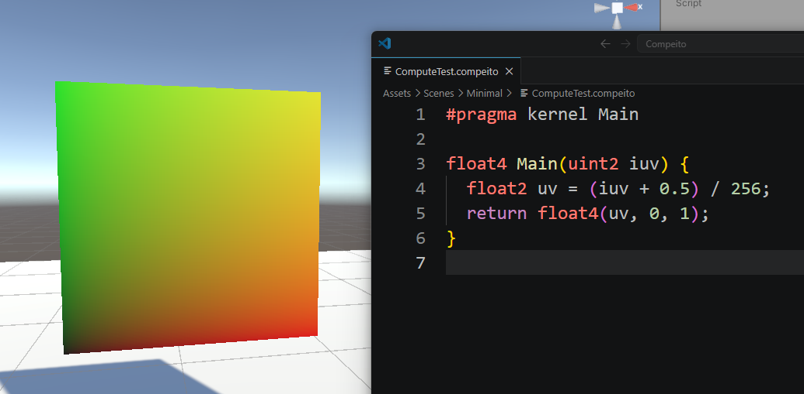

# Compeito

Automatic shader/material generation from `.compeito` snippets,
for writing GPGPU procedures for VRChat in a ComputeShader-like style.

`.compeito` ファイルからシェーダ・マテリアルを自動生成します。
VRChat で GPGPUっぽいことをするときに Compute Shader っぽく書けるようにするための仕組みです。



## Usage

Install from VPM: https://phi16.github.io/VRC_Packages/

0. Create a new `.compeito` file from the context menu, or from scratch.
1. Write your shader function (e.g. `float4 Main(uint2 id) { ... }`) in HLSL as usual.
    - Input: Texel location (`uint2`, in pixels) of the output texture
    - Output: The value (typically `float4`) to output
2. Declare `#pragma kernel Main` to create a shader pass.
    - You can declare multiple passes.
    - You must declare all kernels at the top of the `.compeito` file.
    - You can also declare the output type, like `#pragma kernel Main float4`.
3. You've got the generated shader and material! 🎉
4. `passIndex = material.FindPass("Main");` to get the pass index.
5. `Compeito.Dispatch(material, passIndex, outputTexture);` to dispatch the kernel.

&nbsp;

0. 新規 `.compeito` ファイルを右クリックメニューから (か新規ファイルとして) 作成します。
1. シェーダ関数をHLSLで普通に (`float4 Main(uint2 id) { ... }` という感じで) 書きます。
    - 入力: 書き込み先のテクセル座標 (`uint2`, ピクセル単位)
    - 出力: 書き込みたい値 (典型的には `float4`)
2. `#pragma kernel Main` を宣言するとシェーダパスが作成されます。
    - 複数パス宣言することもできます。
    - 全てのカーネル宣言は `.compeito` ファイルの先頭で行う必要があります。
    - また、書き込む値の型を `#pragma kernel Main float4` のように宣言できます。
3. これでシェーダとマテリアルが生成されました！ 🎉
4. `passIndex = material.FindPass("Main");` と書いてパス (のインデックス) を取得し、
5. `Compeito.Dispatch(material, passIndex, outputTexture);` で処理を実行します。

## Repository contents

- Examples (highly recommended to check out / まず見てもらうといいと思います)
  - Minimal
    - [ComputeTest.compeito](https://github.com/phi16/Compeito/blob/main/Packages/com.imaginantia.compeito/Samples~/Minimal/ComputeTest.compeito)
    - [ComputeTest.cs](https://github.com/phi16/Compeito/blob/main/Packages/com.imaginantia.compeito/Samples~/Minimal/ComputeTest.cs)
  - Fluid
    - [FluidCompute.compeito](https://github.com/phi16/Compeito/blob/main/Packages/com.imaginantia.compeito/Samples~/Fluid/Compute/FluidCompute.compeito)
    - [FluidCompute.cs](https://github.com/phi16/Compeito/blob/main/Packages/com.imaginantia.compeito/Samples~/Fluid/Compute/FluidCompute.cs)
- Main implementation
  - [CompeitoImporter.cs](https://github.com/phi16/Compeito/blob/main/Packages/com.imaginantia.compeito/Editor/CompeitoImporter.cs)
- Udon utility
  - [Compeito.cs](https://github.com/phi16/Compeito/blob/main/Packages/com.imaginantia.compeito/Udon/Compeito.cs)

## Origin of the name

こんぺいとう (Konpeito) is a traditional Japanese sugar candy, small and cute.

## Syntax Highlighting for VSCode

Add the following to your `.vscode/settings.json`.

```
{
  "files.associations": {
    "*.compeito": "hlsl"
  }
}
```

## Note

- PC platform 以外の動作は未確認 (確認予定)
- VRChat SDK が入っていない状態でも一応動きます

## License

MIT

(なお、Compeito を使って生成された shader/material には MIT License は適用されないので、特にワールドクレジットなどに載せる必要はありません。)
